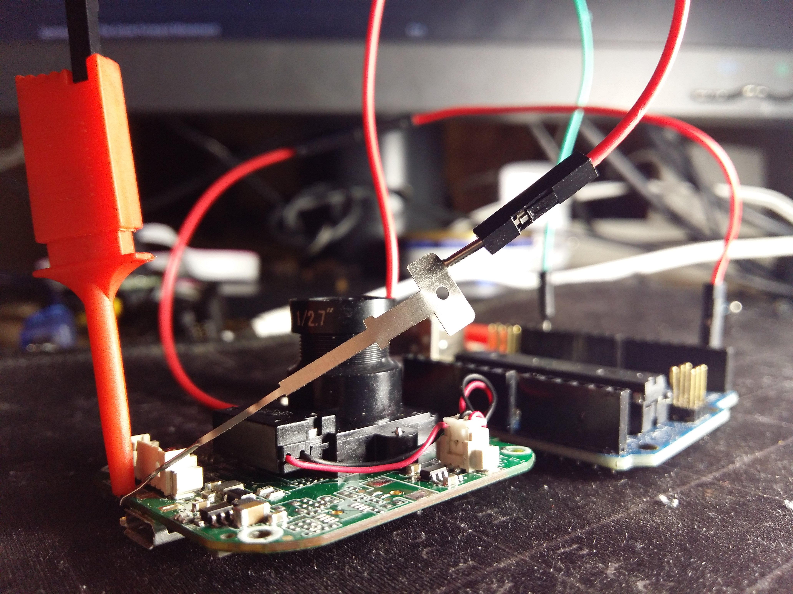
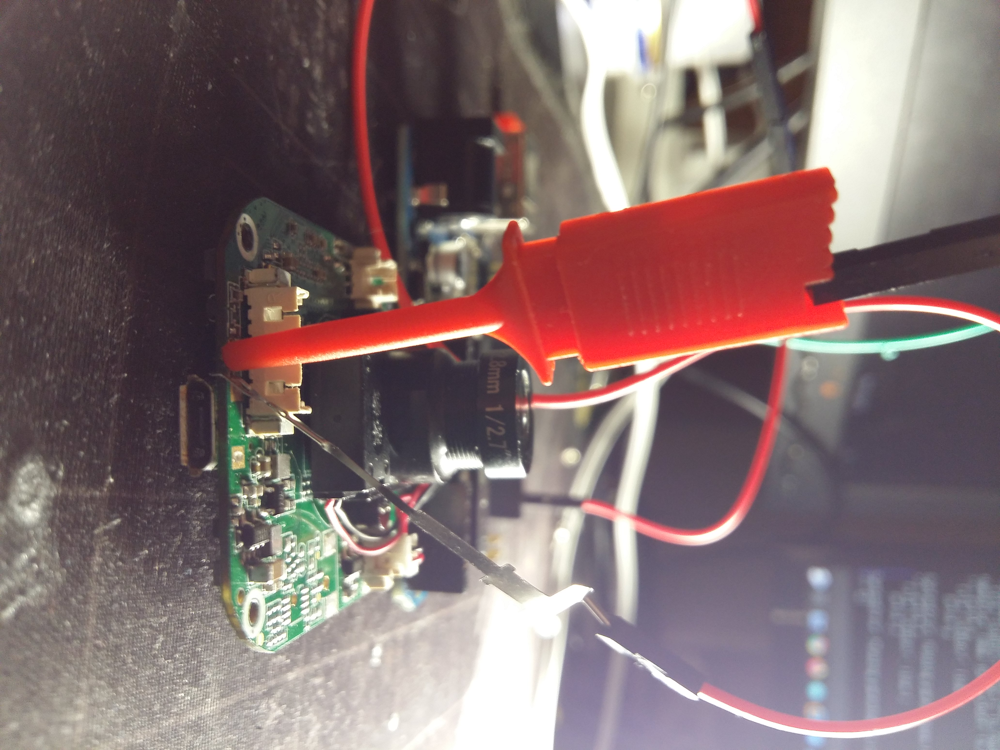
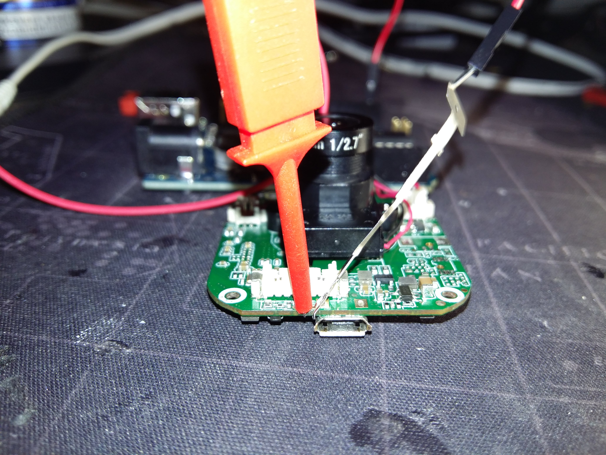
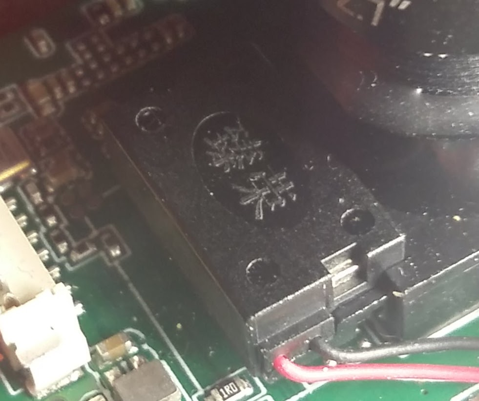
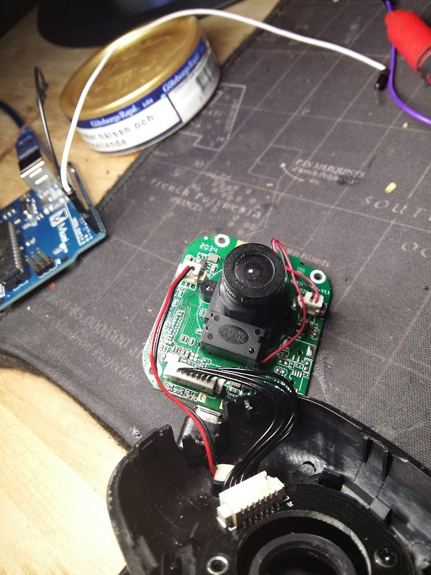

# DLink 6100LH

Update: I was about to use tcl and expect to write a brute-force scripts for find the pin-code but it was never neded.

#### Hardware Used:

  * Arduino SA Uno R3 (CDC ACM)
  * DLINK 6100LH IPCam
  * System: Gentoo Linux

#### About/Info/Reason 

Why I disassembled this dlink camera is because I did not have the password and in the Dlinks app you can only add the camera by connecting to their wifi so I disassembled the device and hoped that it would be easy to get root access and solve this the problem.

It was easy done and there is three screws to disassemble this device and three contacts to release, txd/rxd/ gnd I found within 1 seconds, to the left of the micro-usb input, see pictures below.

However, I logged in to the access point from the camera since password is printed in stdout when reading serial console and now I could finally use the camera because it is quite good for the cheap price you get it for in 1080p, **I THOUGHT!**

When I reached the last setting, the dlink / camera also requires a PIN code and now I have to hack the device anyway and bypass the login (update: this is now done, see more below)

### Some photos taken during the process

#### The chinese characters, I tried google the characters without any luck and didnt spend more time in digging deeper but Im sure D-Link doing as everyone else, buying some cheap cameras from china, putting their own awful logo on it and re-selling it for 10x higher price then in china. We all can belive how things are but proof is allways neded. What a fucking joke, Boycott all IoT and american companies for your own safety and go buy the IoT devices from asia instead, no reason to pay 10x when you dont need.

#### And we all *nix n3rds is well aware of 2034, odd odd its on the board on this camera. See upper left corner :) 

#### STdin/STdout 

* We read serial console with a while loop and writing to a file, with some simple bash tricks without using screen or other tools, we can write to file and grep what we want as we want, see below:

* Script for read serial communication

      #!/bin/bash

      while true; 
        do tty=/dev/ttyACM0
        exec 4<$tty 5>$tty
        stty -F $tty 115200 -echo >&5;
        read reply <&4;echo "$reply"; 
      done |tee dc_6200lh.txt

##### Grep Password

* We can read the dc_6200lh.txt in realtime, and also we can grep what we want - **Nice**! 

      tail -f dc_6200lh.txt |egrep -i "Wifi_ap_pwd"
 
##### And here we go, pin-code found:

    tail -f dc_6200lh.txt|egrep -o 'user=admin,pass=......' 

   
* Catching, **done**.  No hacks needed and no brute-force needed.

#### See Full Boot Process

Right click on the video and press open image on a new tab for get 1080p resolution for readable text.

#### There is nothing more to add about this device that is interesting that you cant figure out yourself, btw, default ip and opened ports: 

    IP: 192.168.0.20 
    
    Ports: 
    554
    8080
    7000
    6000
 
* Access UBOOT by hit any key before 5 seconds when it boots, and from u-boot menu you should read on some wiki how to use the commands but printenv or 'pr' will print the interesting things, to edit bootargs for example you just tneet to type: 
 
       setenv bootargs console=ttyS0,115200............... 
   
Bypass login by add the below line to bootargs but it is really not needed since password is the pin-code we can grab as on the vide above the default user is, yeah watch the video, admin!

       setenv bootargs $(BOOTARGS) init=/bin/sh 

## Changelog

[Versions changelog](CHANGELOG.md).

## Authors: 

* **wuseman <wuseman@nr1.nu\>** 

## License

This project is licensed under the GNU General Public License v3.0 - see the [LICENSE.md](LICENSE.md) file for details

### Contact

  If you have problems, questions, ideas or suggestions please contact me on *_wuseman@nr1.nu_  - For faster contact visit Libera irc network or the webchat and type '/msg wuseman hi!' in the input bar and I will reply to you ASAP.
  
  Enter Libera's network via your own client 'chat.libera.chat:+6697 or use their new web client [here](https://web.libera.chat/).

#### Happy Hacking! 
